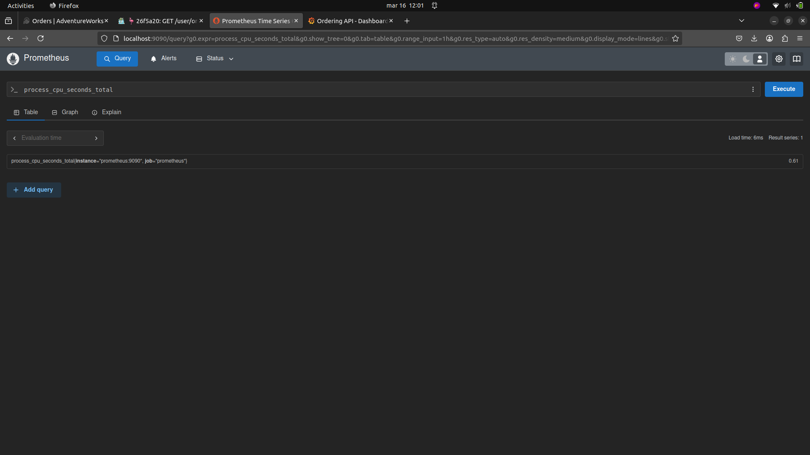

# Integrating OpenTelemetry & Security in eShop - Software Architectures 1st Individual Project
Maria João Machado Sardinha (108756)

### 1. Report & Demo:
- ### [**Report**](report_and_demo/report.pdf)
- ### [**Demo**](report_and_demo/demo.mp4)

### 2. Implementation:

1) Fork and clone the [eShop](https://github.com/dotnet/eShop/tree/main) repository.
2) Chosen feature: "**Place an Order**".
3) Feature exploration.
4) Tracing implementation.
5) Jaeger, Prometheus, and Grafana implementations.
6) Masking: Implementation of a [Processor](src/eShop.ServiceDefaults/Telemetry/PiiScrubberProcessor.cs) to mask sensitive data.
7) Configuration of Dockers and Tools to Monitor Metrics:
    - [docker-compose.observability.yml](docker-compose.observability.yml).
    - [prometheus.yml](prometheus/prometheus.yml).
    - [datasources.yml](grafana/provisioning/datasources/datasources.yml).
    - [dashboard.yml](grafana/provisioning/dashboards/dashboards.yml).
    - [grafanaDashboard.json](grafana/provisioning/dashboards/grafanaDashboard.json).
8) Load Tests: Implemented using *K6*: [loadTest.js](loadTest.js).

### 3. How to Run the Project:
In project's folder (**eShop**), run:
```
docker-compose -f docker-compose.observability.yml up -d

dotnet run --project src/eShop.AppHost/eShop.AppHost.csproj
```

For the load tests, run:
```
k6 run loadTest.js
```


Verify traces/metrics in:
- [Jaeger](http://localhost:16686)
- [Prometheus](http://localhost:9090)
- [Grafana](http://localhost:3000)

### 4. Diagram:


### 5. Useful Links:
- **AdventureWorks website**: https://localhost:7298


- **eShop Resources**: https://localhost:19888

- **Jaeger**: http://localhost:16686


- **Prometheus**: http://localhost:9090


- **Grafana**: http://localhost:3000


### 6. Modified/Created code files:
- [Directory.Packages.props](Directory.Packages.props)
- [docker-compose.observability.yml](docker-compose.observability.yml)
- [grafana/provisioning/dashboards/dashboards.yml](grafana/provisioning/dashboards/dashboards.yml)
- [grafana/provisioning/dashboards/grafanaDashboard.json](grafana/provisioning/dashboards/grafanaDashboard.json)
- [grafana/provisioning/datasources/datasources.yml](grafana/provisioning/datasources/datasources.yml)
- [loadTest.js](loadTest.js)
- [prometheus/prometheus.yml](prometheus/prometheus.yml)
- [src/Basket.API/Grpc/BasketService.cs](src/Basket.API/Grpc/BasketService.cs)
- [src/Identity.API/Identity.API.csproj](src/Identity.API/Identity.API.csproj)
- [src/Identity.API/Program.cs](src/Identity.API/Program.cs)
- [src/Identity.API/appsettings.json](src/Identity.API/appsettings.json)
- [src/Ordering.API/Application/Commands/CreateOrderCommandHandler.cs](src/Ordering.API/Application/Commands/CreateOrderCommandHandler.cs)
- [src/Ordering.API/Application/Telemetry/OrderingTelemetry.cs](src/Ordering.API/Application/Telemetry/OrderingTelemetry.cs)
- [src/Ordering.API/Ordering.API.csproj](src/Ordering.API/Ordering.API.csproj)
- [src/Ordering.API/Program.cs](src/Ordering.API/Program.cs)
- [src/Ordering.API/Properties/launchSettings.json](src/Ordering.API/Properties/launchSettings.json)
- [src/Ordering.API/appsettings.json](src/Ordering.API/appsettings.json)
- [src/WebApp/Program.cs](src/WebApp/Program.cs)
- [src/WebApp/WebApp.csproj](src/WebApp/WebApp.csproj)
- [src/WebApp/appsettings.json](src/WebApp/appsettings.json)
- [src/eShop.AppHost/eShop.AppHost.csproj](src/eShop.AppHost/eShop.AppHost.csproj)
- [src/eShop.ServiceDefaults/Extensions.cs](src/eShop.ServiceDefaults/Extensions.cs)
- [src/eShop.ServiceDefaults/Telemetry/PiiScrubberProcessor.cs](src/eShop.ServiceDefaults/Telemetry/PiiScrubberProcessor.cs)
- [src/eShop.ServiceDefaults/eShop.ServiceDefaults.csproj](src/eShop.ServiceDefaults/eShop.ServiceDefaults.csproj)
- [images folder](img/)
- [src/Identity.API/Quickstart/Account/AccountController.cs](src/Identity.API/Quickstart/Account/AccountController.cs)
- [src/Identity.API/Quickstart/Consent/ConsentController.cs](src/Identity.API/Quickstart/Consent/ConsentController.cs)
- [src/Identity.API/Quickstart/Device/DeviceController.cs](src/Identity.API/Quickstart/Device/DeviceController.cs)
- [src/Identity.API/Quickstart/Grants/GrantsController.cs](src/Identity.API/Quickstart/Grants/GrantsController.cs)

### 7. Future Work:
- Enhance security mechanisms further, particularly in database encryption.
- Expand load testing scenarios.
- Add more metrics.
- Explore additional tracing features.
- Refine dashboards.
