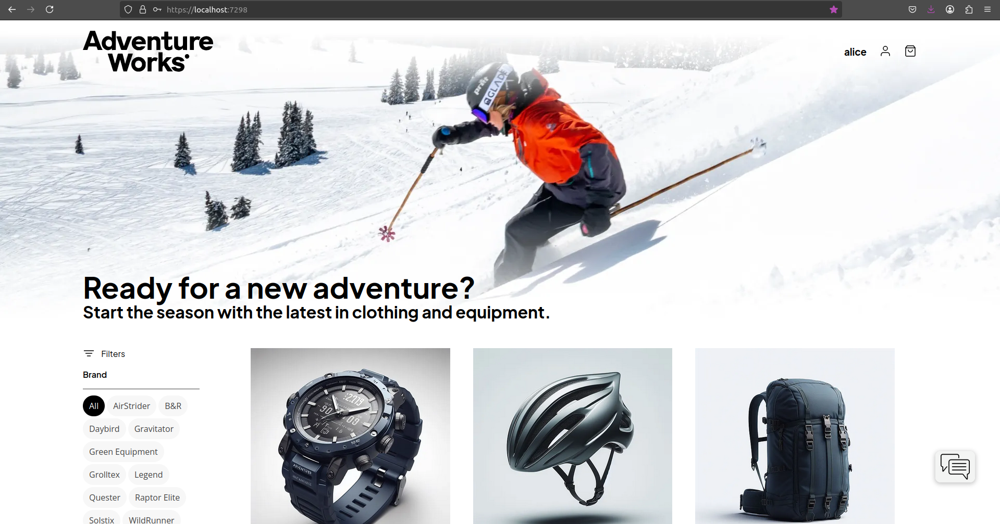

# Integrating OpenTelemetry & Security in eShop - S.A. Project
Maria Sardinha (108756)

Course: Software Architecture

### 1. Objectives:
This project has as objective enhancing the **eShop** e-commerce system by integrating **OpenTelemetry tracing** for a selected feature, while ensuring secutiry best practices (e.g.: masking sensitive information data). Observability is also improved using **Grafana dashboards** to visualize traces and metrics.

**Principal Objectives:**
- Implement Tracing of a features using OpenTelemtry.
- Ensure that sensitive data is masked/excluded from logs and traces.
- Configure a dashboard in Grafana to visualize metrics and traces.
- (Optional - not implemented) Implement additional security by masking DB columns.


### 2. Imolementation:

1) Fork and Clone the [eShop](https://github.com/dotnet/eShop/tree/main) repository.
2) Chosen Feature: "**Place an Order**".
3) Exploração da Funcionalidade
4) Tracing implementation.
5) Jaeger, Prometheus, and Grafana implementations.
6) Masking: Implementation of a [Processor](PiiScrubberProcessor.cs) to mask sensitive data.
7) Configuration of Dockers and Tools to Monitor Metrics:
    - [docker-compose.observability.yml](docker-compose.observability.yml).
    - [prometheus.yml](prometheus/prometheus.yml).
    - [datasources.yml](grafana/provisioning/datasources/datasources.yml).
    - [dashboard.yml](grafana/provisioning/dashboards/dashboards.yml).
    - [grafanaDashboard.json](grafana/provisioning/dashboards/grafanaDashboard.json).
8) Load Tests: Implemented using *K6*: [loadTest.cs](loadTest.cs).

### 3. Running the Project:
In project's folder (**eShop**):
```
docker-compose -f docker-compose.observability.yml up -d

dotnet run --project src/eShop.AppHost/eShop.AppHost.csproj
```

For the load tests, run:
```
k6 run loadTest.js
```

(verify traces/metrics in [Jaeger](http://localhost:16686), [Prometheus](http://localhost:9090), and [Grafana](http://localhost:3000))

### 4. Diagram:


### 5. Useful Links:
- AdventureWorks website: https://localhost:7298


- eShop Resources: https://localhost:19888

- Jaeger: http://localhost:16686


- Prometheus: http://localhost:9090


- Grafana: http://localhost:3000


### 6. Modified/Created code files:

### 7. Future Work:
- Improve security aspects.
- Add more load tests.
- Add more views and metrics.
