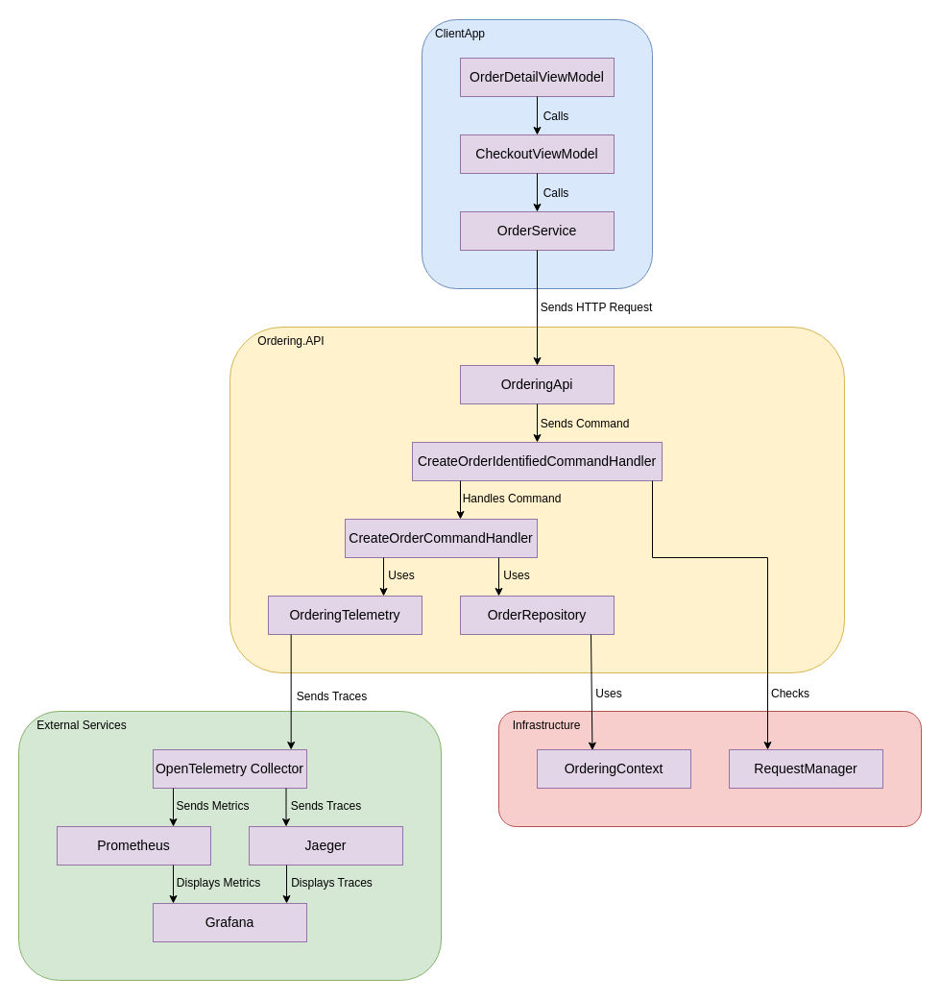
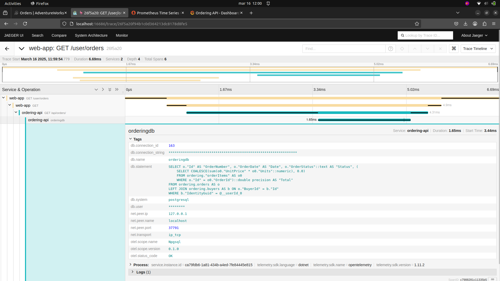

# Integrating OpenTelemetry & Security in eShop - Projeto A.S.
Maria Sardinha (108756)

Cadeira: Arquiteturas de Software

### 1. Objetivo:
Este projeto tem como objetivo a implementação de tracing com **OpenTelemetry** no repositório **eShop**, de forma a que o fluxo de execução seja visível e que seja feita uma proteção adequada de dados sensíveis.

**Principais objetivos:**
- Implementar Tracing duma feature com OpenTelemtry.
- Garantir que dados sensíveis sejam mascarados/excluídos dos logs e traces.
- Configurar um dashboard no Grafana para visualizar métricas e traces.
- (Opcional) Implementar segurança adicional, mascarando colunas da BD.


### 2. Implementação:

1) Fork e Clone do repositório [eShop](https://github.com/dotnet/eShop/tree/main).
2) Funcionalidade Escolhida: "**Place an Order**".
3) Exploração da Funcionalidade
4) Implementação de Tracing.
5) Implementação de Jaeger, Prometheus, e Grafana.
6) Masking: Implementação dum [Processor](PiiScrubberProcessor.cs) para mascarar os dados sensíveis.
7) Configuração dos Dockers e das Ferramentas para Monitorizar as Métricas:
    - [docker-compose.observability.yml](docker-compose.observability.yml).
    - [prometheus.yml](prometheus/prometheus.yml).
    - [datasources.yml](grafana/provisioning/datasources/datasources.yml).
    - [dashboard.yml](grafana/provisioning/dashboards/dashboards.yml).
    - [grafanaDashboard.json](grafana/provisioning/dashboards/grafanaDashboard.json).
8) Load Tests: Implementados usando K6: [loadTest.cs](loadTest.cs) (implementado parcialmente)

### 3. Como construir e correr o ambient eShop:
Na pasta do projeto (eShop):
```
docker-compose -f docker-compose.observability.yml up -d

dotnet run --project src/eShop.AppHost/eShop.AppHost.csproj
```

Para os testes de carga (não implementado totalmente), correr:
```
k6 run loadTest.js
```

### 4. Diagrama (Esboço Inicial):


### 5. Links Úteis:
- AdventureWorks website: https://localhost:7298


- eShop Resources: https://localhost:19888

- Jaeger: http://localhost:16686



- Prometheus: http://localhost:9090


- Grafana: http://localhost:3000


### 6. Trabalho Futuro:
- Melhorar Aspetos de Segurança.
- Corrigir Testes de Carga.
- Adicionar mais visualizações.